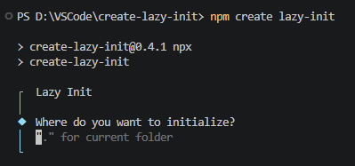

# create-lazy-init

The ultra-lean, zero-fluff project scaffolding tool.

I built this because running standard template initializers forces you to spend the first 10 minutes deleting default styling, asset files, and bloated configurations you never asked for. This CLI skips the junk and spits out clean, bare-bones folder structures so you can actually get to work.

### Quick Start
You don't even need to install it. Just run this in your terminal:

```Bash
npm create lazy-init
```

###### In-Place Setup
If you like creating a folder first, opening it in VS Code, and running the tool directly inside it, just type a dot (.) to initialize in current folder. 

```Bash
npm create lazy-init .
```
When running without specified path the CLI will ask and the same rules apply.


## Available presets

### 1. Static (Frontend Only)
Powered by a highly stripped-back Vite instance. No default logos, no counter buttons, and only basic css.


```Plaintext
my-app/
├── public/
├── src/
│   ├── assets/
│   ├── main.css
│   ├── main.js (or .ts)
│   └── App.jsx (or .vue)
├── .gitignore
├── index.html
├── package.json
└── vite.config.js (not for vanilla)
```
### 2. Dynamic (Fullstack Split)
A perfectly isolated monorepo environment. The frontend handles the client-side, and the backend handles the server-side with zero cross-contamination.

```Plaintext
my-app/
├── client/   # Clean Static setup (cleaned up vite)
└── server/   # Pure Express.js backend (no boilerplate clutter)
     ├── server.js   # Currently only supports express
     └── .env  # Only some basic environmental variables
```

### Current Stack Support
#### __Frontend:__ 
- Vanilla (JS/TS) 
- React (JS/TS)
- Vue (JS/TS)

#### __Backend:__ 
- Express.js

#### __Architecture Style:__ 
- Isolated Client/Server Split

## Roadmap (Planned Fluff)
Features being built out as optional, opt-in prompts during setup:
- [ ] Automated Git repository initialization (`git init`)
- [ ] Optional Tailwind CSS setup (with pre-configured `tailwind-merge` utilities)
- [ ] Optional Creative Suite toggle (Installs GSAP + Lenis Smooth Scroll setup)
- [ ] API-only backend architecture setup (skips the frontend completely)